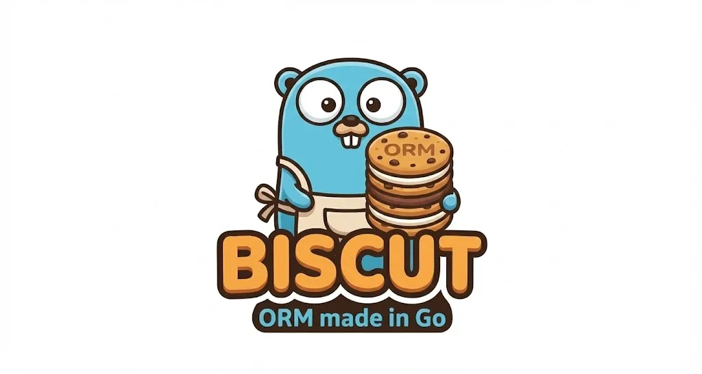

# Biscut ORM 🧁

A **lightweight Go ORM** that lets you work with SQL databases using simple, expressive Go code — without hiding SQL entirely.

Biscut currently supports:

* **SQLite**
* **PostgreSQL (psql)**

Designed for learning, experimentation, and small-to-medium projects where you want **control + convenience**.



---

## ✨ Features

* Dialect-based design (SQLite & PostgreSQL)
* Programmatic table definitions
* Automatic table creation
* CRUD operations
* Simple query helpers
* Minimal magic — transparent SQL behavior

---

## 📦 Installation

```bash
go get github.com/adeebatgithub/biscut
```

---

## 🚀 Quick Start

### 1️⃣ Create a Manager

#### SQLite

```go
manager, err := NewManager(connections.SqliteConfig{
    Database: "db.sqlite3",
})
if err != nil {
    panic(err)
}
```

#### PostgreSQL

```go
manager, err := NewManager(connections.PSQLConfig{
    Host:     "localhost",
    Port:     5432,
    Username: "postgres",
    Password: "password",
    Database: "testdb",
    SslMode:  "disable", // or "require"
})
if err != nil {
    panic(err)
}
```

---

### 2️⃣ Define a Table

```go
UserTable := Table{
    TableName: "User",
    Fields: map[string]string{
        "id":       manager.Dialect.PrimaryKey(),
        "username": manager.Dialect.VarCharField(25, true, true),
    },
}
```

> 💡 **Tip:** Using lowercase table and column names is recommended for cross-database compatibility.

---

### 3️⃣ Create the Table

```go
err = manager.CreateTable(&UserTable)
if err != nil {
    fmt.Println(err)
}
```

---

## 🧾 CRUD Operations

### ➕ Insert Data

```go
data := map[string]string{
    "username": "root",
}
err = manager.Insert("User", data)
```

---

### 📥 Fetch All Rows

```go
data, err := manager.FetchAll("User", "", false)
if err != nil {
    fmt.Println(err)
}
fmt.Println(data)
```

---

### 🔍 Fetch With WHERE Condition

```go
where := map[string]string{
    "username": "root",
}

data, err := manager.FetchWhere("User", where, "", false)
```

---

### 📄 Fetch Single Column

```go
data, err := manager.FetchCol("User", "username", "", false)
```

---

### 🆔 Fetch By ID

```go
data, err := manager.FetchByID("User", "1")
```

---

### ✏️ Update Row

```go
where := map[string]string{
    "id": "1",
}

cols := map[string]string{
    "username": "superuser",
}

err = manager.Update("User", cols, where)
```

---

### ❌ Delete Row

```go
where := map[string]string{
    "id": "2",
}

err = manager.Delete("User", where)
```

---

## 🧠 Design Philosophy

* Explicit over implicit
* No reflection-heavy magic
* SQL-friendly abstractions
* Easy to read, easy to debug

Biscut is ideal if you want **just enough ORM** without losing control.

---

## 🤝 Contributing

Pull requests are welcome!

1. Fork the repo
2. Create your feature branch
3. Commit your changes
4. Open a PR

---

## ⭐ Support

If you like this project, consider giving it a **star** on GitHub — it really helps!
